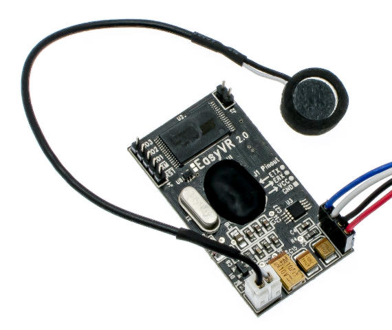
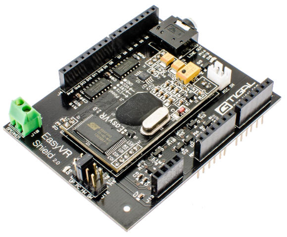

EasyVR Arduino library
======================

*Copyright (C) 2011-2014 RoboTech srl*

Written for Arduino and compatible boards for use with EasyVR modules or
EasyVR Shield boards produced by [VeeaR](http://www.veear.eu)

> 
> 

Library code is released under the terms of the MIT license, as found in the accompanying
file COPYING.txt or at this address: <http://www.opensource.org/licenses/MIT>

Example code is released to the Public Domain, as found in the accompanying
file COPYING.txt or at this address: <http://creativecommons.org/publicdomain/zero/1.0/>

----------
